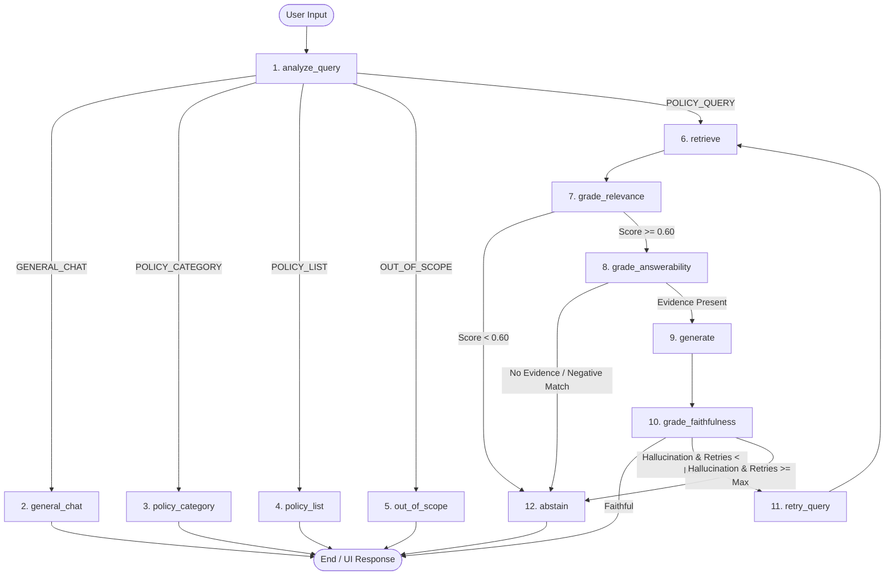

# 🛡️ Enterprise Policy RAG + Agentic AI Assistant

[](https://www.python.org/)
[](https://fastapi.tiangolo.com/)
[](https://www.langchain.com/langgraph)
[](https://qdrant.tech/)
[](https://react.dev/)
[](https://anthropic.com)

An enterprise-grade, production-style **Company Policy Assistant** powered by **LangGraph Agentic Orchestration**, **OLMo Language Model**, **Hybrid Retrieval (Qdrant Vector DB + BM25 Lexical Index)**, **Reciprocal Rank Fusion (RRF)**, **Cross-Encoder Reranking**, and strict **Answerability & Faithfulness Guardrails**.

> **Note**: The entire modern minimalist white frontend interface (React 18 + Vite, point-wise markdown rendering, slide toggle sources, and dynamic chat history management) was developed by **Claude AI**.

---

## 🌟 Core Philosophy: *"No Evidence → No Answer"*

Unlike generic chatbots that hallucinate plausible answers when documents lack explicit facts, this system enforces multi-stage deterministic and neural guardrails:
1. **Semantic Intent Routing**: Distinguishes general chat, small talk, broad policy overviews, and policy listings before triggering RAG retrieval.
2. **Topical Relevance Grader**: Filters out irrelevant noise from retrieved candidate chunks.
3. **Answerability Guardrail**: Checks whether facts directly address the inquiry before calling the LLM. If ungrounded or absent, it **safely abstains without hallucinating**.
4. **OLMo Grounded Synthesis**: Generates clean, point-wise structured responses based strictly on verified context.
5. **Faithfulness Verifier**: Verifies every claim against source policy context.

---

## 🔄 End-to-End Agentic Pipeline Flow

```
                                  USER INPUT
                                      │
                                      ▼
                      ┌───────────────────────────────┐
                      │    Semantic Intent Router     │
                      └───────────────┬───────────────┘
                                      │
          ┌─────────────────┬─────────┴─────────┬─────────────────┐
          ▼                 ▼                   ▼                 ▼
   GENERAL_CHAT      POLICY_CATEGORY       POLICY_LIST       OUT_OF_SCOPE
   (Hello, Help,     (Overview of HR,      (List all         (Weather, Code,
   Sample Questions)  Benefits, Travel)     active policies)  General Trivia)
          │                 │                   │                 │
          ▼                 ▼                   ▼                 ▼
     Direct Chat      Category Brief +     Active Policy     Polite Scope
      Response        Sample Questions        Summary         Redirect
          │                 │                   │                 │
          └─────────────────┴─────────┬─────────┴─────────────────┘
                                      │
                                      ▼
                              [ USER INTERFACE ]
                                      ▲
                                      │ (When Intent == POLICY_QUERY)
                                      │
┌─────────────────────────────────────┴───────────────────────────────────────┐
│                           AGENTIC RAG PIPELINE                              │
│                                                                             │
│  1. Query Analysis & Semantic Expansion                                     │
│     ├── Extracts domain keywords & normalizes synonyms                      │
│     └── Builds expanded query vector representation                         │
│                                                                             │
│  2. Hybrid Retrieval                                                        │
│     ├── Dense Semantic Retrieval: Qdrant Vector DB (Cosine Similarity)      │
│     └── Lexical Keyword Retrieval: Okapi BM25 Index                         │
│                                                                             │
│  3. Reciprocal Rank Fusion (RRF, k=60)                                      │
│     └── Fuses dense + sparse ranked lists: RRF(d) = Σ 1 / (k + rank_i(d))   │
│                                                                             │
│  4. Cross-Encoder Reranking                                                 │
│     └── Scores and selects top candidate context passages                   │
│                                                                             │
│  5. Relevance Grader Node                                                   │
│     └── Filters chunks below 0.60 relevance threshold                       │
│                                                                             │
│  6. Answerability Guardrail Node                                            │
│     ├── Checks explicit concept match and negative query signals            │
│     ├── [Ungrounded / Missing Evidence] ──► ABSTAIN NODE (Safe Refusal)    │
│     └── [Verified Facts Present]        ──► GENERATE NODE                   │
│                                                                             │
│  7. OLMo Synthesis Node                                                     │
│     └── Point-wise bullet synthesis strictly grounded in evidence           │
│                                                                             │
│  8. Faithfulness Verifier Node                                              │
│     ├── [Hallucination Detected] ──► Self-Correction / Retry Loop           │
│     └── [Faithful]               ──► CITATION & METADATA MAPPER             │
│                                                                             │
│  9. Citation Mapper Node                                                    │
│     └── Maps Policy Name, Section, Page, and Snippet to response            │
└─────────────────────────────────────────────────────────────────────────────┘
```

---

## 🧩 Node-by-Node Pipeline Architecture

The core agent workflow is orchestrated with **LangGraph**, where state transitions between 12 distinct nodes through deterministic and conditional edges:



### 📋 Detailed Node Directory

| # | Node Name | Role & Responsibility | Key Logic & Output | Next Transition |
|---|:---|:---|:---|:---|
| **1** | `analyze_query` | **Intent Router & Query Parser** | Classifies incoming query into one of 5 intents (`GENERAL_CHAT`, `POLICY_CATEGORY`, `POLICY_LIST`, `OUT_OF_SCOPE`, `POLICY_QUERY`) and generates expanded keyword representations. | Routes conditionally to nodes 2, 3, 4, 5, or 6. |
| **2** | `general_chat` | **Conversational Assistant** | Handles greetings, identity, small talk, gratitude, and suggests sample questions without RAG overhead. | Direct terminal to `END`. |
| **3** | `policy_category` | **Category Guide** | Provides broad summaries for categories (HR, Leave, Travel, Remote, IT, Benefits, Ethics) with suggested clickable follow-up questions. | Direct terminal to `END`. |
| **4** | `policy_list` | **Active Policy Catalog** | Returns a structured summary list of all currently active policies indexed in the system. | Direct terminal to `END`. |
| **5** | `out_of_scope` | **Enterprise Redirection** | Detects non-policy questions (coding, weather, trivia) and provides a polite enterprise redirection back to company policies. | Direct terminal to `END`. |
| **6** | `retrieve` | **Hybrid Dense + Lexical Retrieval** | Runs vector search (Qdrant with Cosine Similarity) and lexical search (Okapi BM25), merges candidate ranks with **Reciprocal Rank Fusion (RRF, $k=60$)**, and scores with **Cross-Encoder Reranker**. | Transitions to `grade_relevance`. |
| **7** | `grade_relevance` | **Candidate Relevance Filter** | Evaluates candidate chunks against a relevance threshold ($\ge 0.60$), pruning noise and retaining grounded context. | Routes to `grade_answerability` if passed, or `abstain` if empty. |
| **8** | `grade_answerability` | **Deterministic Anti-Hallucination Guardrail** | Enforces *"No Evidence → No Answer"*. Checks for explicit concept match and negative queries (e.g. *housing allowance*, *pets in office*). | Routes to `generate` if facts exist; otherwise routes immediately to `abstain`. |
| **9** | `generate` | **OLMo Grounded Synthesis** | Synthesizes point-wise structured answers (`•`) based strictly on verified context chunks without external assumptions. | Transitions to `grade_faithfulness`. |
| **10** | `grade_faithfulness` | **Self-Correction Verifier** | Verifies that every claim in the response is directly supported by the context snippets. Detects hallucinations or ungrounded statements. | Routes to `END` if faithful, `retry_query` if retry count < max, or `abstain`. |
| **11** | `retry_query` | **Query Rewriter & Self-Correction Loop** | Modifies retrieval parameters and search keywords when generation fails faithfulness grading. | Loops back to `retrieve` (up to `MAX_RETRIES`). |
| **12** | `abstain` | **Safe Compliance Refusal** | Emits a standardized compliance refusal explaining why the query cannot be answered from active policies and advises contacting HR/manager. | Direct terminal to `END`. |

---

## 🏛️ System Architecture

```text
┌───────────────────────────────────────────────────────────────────────────┐
│                                 FRONTEND                                  │
│                     (React 18 + Vite, Minimalist White UI)                │
│                                                                           │
│   • Chat View with Point-wise Markdown Formatting                         │
│   • Slide-down Toggle Button for Policy Sources & Citations               │
│   • Conversation History Sidebar with on-hover Delete                     │
│   • Policy Help Modal for real-time catalog discovery                     │
│   • Real-time Verification Trace (Latency, Scores, Guardrail Status)      │
└─────────────────────────────────────┬─────────────────────────────────────┘
                                      │ HTTP / JSON API
                                      ▼
┌───────────────────────────────────────────────────────────────────────────┐
│                                 BACKEND                                   │
│                           (FastAPI + Python 3.11+)                        │
│                                                                           │
│   • /api/v1/chat/                  : Multi-turn agentic chat endpoint     │
│   • /api/v1/chat/conversations     : Conversation history & deletion      │
│   • /api/v1/policies               : Policy catalog & metadata CRUD       │
│   • /api/v1/admin/                 : Analytics, index rebuild & eval      │
│   • /api/v1/health                 : Health checks & system telemetry     │
└───────────────────┬───────────────────────────────────┬───────────────────┘
                    │                                   │
                    ▼                                   ▼
┌──────────────────────────────────────┐ ┌──────────────────────────────────┐
│          RAG / VECTOR STORE          │ │             DATABASE             │
│                                      │ │                                  │
│  • Qdrant Vector Store (Dense)       │ │  • SQLite / PostgreSQL           │
│  • BM25 In-Memory Index (Sparse)     │ │  • Conversations & Messages      │
│  • HuggingFace BGE Embeddings        │ │  • Policies & Version History    │
│  • BGE Cross-Encoder Reranker        │ │  • Audit & Retrieval Logs        │
└──────────────────────────────────────┘ └──────────────────────────────────┘
```

---

## 📁 Repository Structure

```text
policy-rag-chatbot/
│
├── backend/
│   ├── app/
│   │   ├── api/v1/              # FastAPI endpoints (chat, policies, admin, health)
│   │   ├── core/                # Configuration, logging, security, exceptions
│   │   ├── database/            # SQLAlchemy models, SQLite/PG connection, repositories
│   │   ├── graders/             # Relevance, Answerability, Faithfulness, Citation graders
│   │   ├── graph/               # LangGraph state, nodes, conditional edges, workflow
│   │   ├── llm/                 # OLMo model pipeline & deterministic grounded engine
│   │   ├── rag/                 # Chunker, embeddings, Qdrant store, BM25, RRF, reranker
│   │   ├── router/              # Multi-intent semantic query router & classifiers
│   │   ├── schemas/             # Pydantic validation schemas
│   │   ├── services/            # Chat service & orchestration
│   │   └── main.py              # Application entrypoint & auto-seeding
│   ├── tests/                   # Pytest unit & integration test suites
│   ├── requirements.txt
│   ├── Dockerfile
│   └── .env
│
├── frontend/
│   ├── src/
│   │   ├── components/          # AIMessage (with Slide Sources), UserMessage, HelpModal, etc.
│   │   ├── pages/               # Chat (Sidebar history + on-hover delete), Admin
│   │   ├── services/            # Frontend API client
│   │   ├── index.css            # Minimalist white theme styling
│   │   └── App.jsx
│   ├── package.json
│   └── vite.config.js
│
├── data/
│   ├── policies/                # Markdown corporate policies (HR, Remote Work, Benefits, etc.)
│   └── evaluation/              # Benchmark questions & No-Answer evaluation set
│
├── scripts/
│   ├── seed_database.py         # Ingests policy corpus into database & vector store
│   └── evaluate_rag.py          # Benchmark runner computing accuracy & recall metrics
│
├── docker-compose.yml
└── README.md
```

---

## 🚀 Getting Started

### 1. Prerequisites
- **Python**: 3.10+
- **Node.js**: 18+
- **npm** or **yarn**

### 2. Backend Setup

```bash
# Clone the repository
git clone <repo-url>
cd policy-rag-chatbot

# Create virtual environment
python3 -m venv venv
source venv/bin/activate

# Install Python dependencies
pip install -r backend/requirements.txt
```

### 3. Seed Database & Vector Store

```bash
# Ingests corporate policies (HR, Benefits, IT, Travel, Remote Work, Ethics)
python3 -m scripts.seed_database
```

### 4. Run Test Suite

```bash
PYTHONPATH=. pytest backend/tests/ -v
```

### 5. Start Backend Server

```bash
python3 -m uvicorn backend.app.main:app --host 127.0.0.1 --port 8000 --reload
```
Interactive Swagger documentation available at: `http://127.0.0.1:8000/docs`

### 6. Start Frontend Server

```bash
cd frontend
npm install
npm run dev
```
Open `http://127.0.0.1:5173` in your browser.

---

## 🧪 Testing Benchmark & Examples

### Sample Supported Queries (Returns Point-wise Answer + Citations):
- `"How many days of paid annual leave do full-time employees accrue per year?"` *(HR Policy)*
- `"What is the daily meal per diem for business travel?"` *(Travel & Expense Policy)*
- `"What is the company matching percentage for the 401(k) retirement plan?"` *(Benefits Policy)*
- `"What is the minimum character length and complexity requirement for corporate passwords?"` *(InfoSec Policy)*
- `"What is the threshold for gifts and hospitality that requires compliance approval?"` *(Ethics Policy)*

### Sample Guardrail Abstention (Zero-Hallucination):
- `"Does the company provide a monthly personal housing allowance?"`
  - **Output**: `ℹ️ I couldn't find information regarding your request in the active company policies. (Reason: Concept 'housing' not found)`
- `"Can employees bring pet dogs or cats into the office?"`
  - **Output**: `ℹ️ I couldn't find information regarding your request in the active company policies.`

---

## 🐳 Docker Deployment

Run the complete multi-service stack with a single command:

```bash
docker-compose up --build
```

---

## 🤖 Attribution & Credits

- **Frontend Development & UI Design**: Built and designed by **Claude AI (Anthropic)** — featuring a modern white aesthetic, collapsible history sidebar, slide-down source citations, and real-time verification traces.
- **Backend & RAG Pipeline**: LangGraph, OLMo, Qdrant Vector Search, BM25 Index, Reciprocal Rank Fusion (RRF), and multi-stage verification guardrails.

